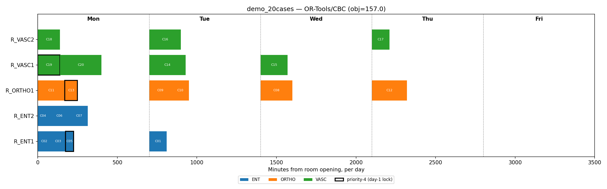
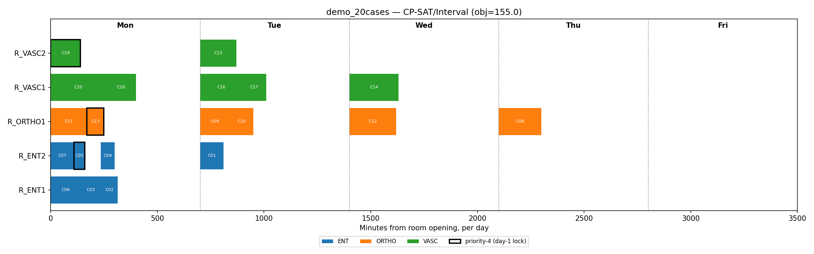
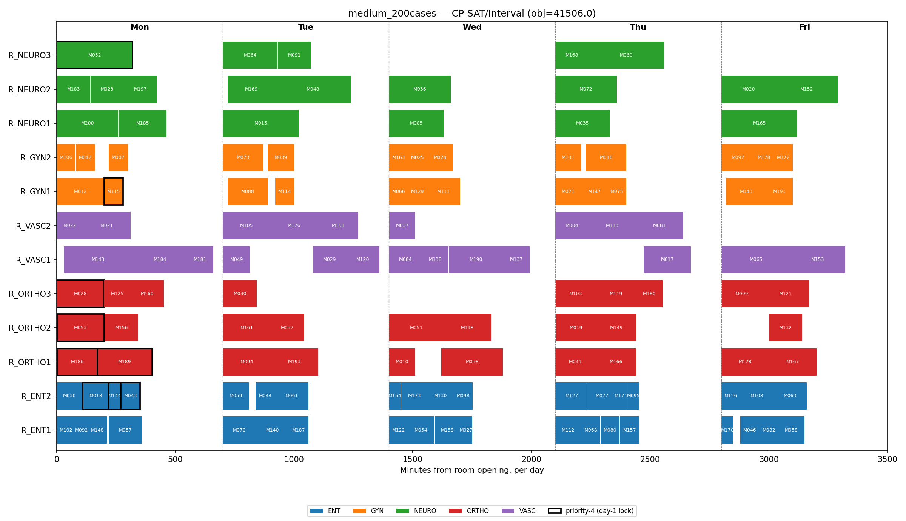

# Elective Surgery Scheduling — Baseline MILP + Production Interval-CP

> A weekly elective-surgery scheduling model for a large hospital group, built as two
> formulations: a baseline MILP and a production-grade interval-based Constraint
> Programming model — solved with **Google OR-Tools** (linear_solver/CBC + SCIP,
> CP-SAT), **Gurobi**, and (optionally) **Hexaly**.

Read **[FORMULATION.md](FORMULATION.md)** first (the baseline math), then
**[PRODUCTION_FORMULATION.md](PRODUCTION_FORMULATION.md)** (the interval-based upgrade),
then **[RESULTS.md](RESULTS.md)** (the benchmark numbers below, with analysis).

---

## Quick Start

```bash
# Core dependency — bundles CBC + SCIP (no external solver binary needed) and CP-SAT
pip install ortools

# Optional: commercial backend for the baseline MILP (requires a license)
pip install gurobipy

# Optional: third point of the trade-off triangle (requires an academic license —
# see src/solvers/hexaly_solver.py for setup; falls back to CBC if absent)
pip install hexaly

# Run the 20-case demo (OR-Tools/CBC baseline)
python main.py

# Run the interval-based production model instead
python main.py --solver cp-sat

# Run the ~200-case scaling instance
python main.py --instance medium --solver cp-sat

# Run every backend and print a comparison table (this is what RESULTS.md is built from)
python main.py --instance demo --benchmark
python main.py --instance medium --benchmark --time-limit 60

# Run the test suite
python tests/test_model.py
```

---

## Repository Structure

```
or-surgery-scheduling/
├── main.py                       # CLI entry point + benchmark mode
├── FORMULATION.md                # Baseline MILP: sets, params, variables, objective, constraints
├── PRODUCTION_FORMULATION.md     # Interval-based CP-SAT: maps onto the baseline, adds exact timing
├── RESULTS.md                    # Demo-vs-medium benchmark numbers + trade-off analysis
├── README.md                     # This file
├── requirements.txt
│
├── src/
│   ├── model/
│   │   ├── types.py              # SurgicalCase, Surgeon, OperatingRoom, PlanningInstance, SolverResult
│   │   └── penalty.py            # w_c non-scheduling penalty weight
│   │
│   ├── solvers/
│   │   ├── base_solver.py            # Abstract interface — solver-agnostic
│   │   ├── milp_baseline_solver.py   # OR-Tools MPSolver (CBC/SCIP) + native gurobipy — BASELINE
│   │   ├── cp_sat_interval_solver.py # OR-Tools CP-SAT, interval-based — PRODUCTION
│   │   ├── hexaly_solver.py          # Hexaly local-search backend (graceful fallback)
│   │   └── greedy_solver.py          # Constructive heuristic (warm-start / sanity bound)
│   │
│   ├── data/
│   │   └── instances.py          # demo_instance() · medium_instance()
│   │
│   └── utils/
│       ├── reporter.py           # Schedule printer + constraint consistency checks
│       └── visualizer.py         # Gantt-style PNG export (--plot)
│
├── tests/
│   └── test_model.py             # Cross-solver acceptance tests (MILP + CP-SAT)
│
└── docs/
    ├── img/                      # Generated schedule plots (see "Visual Schedule" below)
    └── or_surgery_scheduling_beamer.pptx
```

---

## The Model, in Brief

**Sets:** cases $C$, days $D$ (one week), rooms $R$, surgeons $H$, shared equipment $E$.

**Baseline decision variables:** $x_{cdr}\in\{0,1\}$ (case $c$ in room $r$ on day $d$),
$z_c\ge 0$ (case $c$ left unscheduled this week).

**Objective:** minimize a three-term weighted tardiness — prefer scheduling
high-priority, close-to-deadline cases earlier; penalize overdue cases more steeply the
later they're deferred; pay a dominant penalty only when a case truly cannot be fit in.

**Constraints (baseline):** one case per patient/week, priority-4 cases locked to day 1,
schedule-or-penalize for everyone else, room-service eligibility, ambulatory/pediatric
carve-outs, room capacity, surgeon daily/weekly limits, shared-equipment day cap.

**Production upgrade (CP-SAT, interval-based):** the same model, with exact start times
per case, `AddNoOverlap` replacing aggregate room/surgeon sums, `AddCumulative` replacing
the day-count equipment cap with real concurrency, and a downstream recovery/ICU-bed
`AddCumulative` that the baseline deliberately excludes (see FORMULATION.md §8).

Full math, assumptions, and what's deliberately left out: **FORMULATION.md** /
**PRODUCTION_FORMULATION.md**.

---

## Results — Baseline vs. Production Trade-off

Full discussion and methodology in **[RESULTS.md](RESULTS.md)**. Summary:

### Demo instance (20 cases, 5 rooms, 6 surgeons)

| Solver | Status | Objective | Gap | Scheduled | Time |
|---|---|---|---|---|---|
| Greedy | Feasible | 163.0 | — | 20/20 | 0.000s |
| OR-Tools/CBC | Optimal | 157.0 | 0.00% | 20/20 | 0.028s |
| Gurobi | Optimal | 157.0 | 0.00% | 20/20 | 0.186s |
| **CP-SAT/Interval** | **Optimal** | **155.0** | 0.00% | 20/20 | 0.084s |
| Hexaly (→ CBC fallback*) | Optimal | 157.0 | 0.00% | 20/20 | 0.021s |

### Medium instance (200 cases, 12 rooms, 17 surgeons, 60s time limit)

| Solver | Status | Objective | Gap | Scheduled | Time |
|---|---|---|---|---|---|
| Greedy | Feasible | 70,883.0 | — | 124/200 | 0.002s |
| OR-Tools/CBC | Feasible (time-out) | 44,606.0 | 0.90% | 128/200 | 60.085s |
| **Gurobi** | **Optimal** | **44,232.0** | 0.80%† | 129/200 | **0.708s** |
| CP-SAT/Interval | Feasible (time-out) | **40,799.0** | 2.42% | 131/200 | 60.403s |
| Hexaly (→ CBC fallback*) | Feasible (time-out) | 44,606.0 | 0.90% | 128/200 | 60.097s |

\* No Hexaly license in this environment — reports the CBC baseline's result, not its
own; see RESULTS.md for the qualitative expectation with a real license.
† Gurobi's `Optimal` means "within the configured 1% relative-gap tolerance" — its
actual default termination rule, not literally a zero gap.

**What this shows:**

1. **Gurobi vs. CBC, identical formulation:** 0.7s vs. a 60-second time-out on 200
   cases. Same code path, only the backend differs — the standard argument for a
   commercial MILP license once an instance crosses a few hundred binary variables.
2. **CP-SAT finds a *better* objective than both exact MILP solvers, on both
   instances** — not from out-searching them, but from modeling the shared-equipment
   constraint exactly (`AddCumulative`, real time overlap) instead of as a same-day
   headcount cap. On the demo instance this is visible directly in the schedule: CP-SAT
   places two different C-arm cases on the same day, in different rooms, at
   non-overlapping times — a placement the baseline's day-count cap forbids outright
   even though it's perfectly legitimate. On the medium instance this effect is ~8% of
   the objective.
3. **Practical read:** ship OR-Tools/CBC as the free, always-available correctness
   baseline; move production traffic to CP-SAT once instance size makes the
   day-bucket equipment/room approximation costly (it visibly is, above); add Gurobi
   when a hospital needs a *proven* optimum at full scale; evaluate Hexaly for the
   multi-week / real-time-disruption regime once a license is available.

---

## Visual Schedule (Gantt-style)

Per the case prompt: "a plain terminal output or a simple image of the schedule is
plenty." Generated with `python main.py --instance <name> --solver <name> --plot
out.png` (see `src/utils/visualizer.py`). Each bar is one case; outlined bars are
priority-4 (locked to day 1); colors are surgical service.

**Demo instance, baseline MILP** — note cases within a room-day are laid out
back-to-back in an arbitrary order, because the baseline itself makes no claim about
intra-day sequencing (see FORMULATION.md §3):



**Demo instance, CP-SAT production model** — same cases, but with real start/end
clock times and, on Tuesday, two different C-arm cases placed in different rooms at
non-overlapping times (the schedule the baseline's day-count equipment cap forbids —
see RESULTS.md):



**Medium instance (200 cases), CP-SAT production model** — the scaling instance, with
exact per-case start times across all 12 rooms:



(This image's objective may differ slightly run-to-run from the RESULTS.md table —
CP-SAT's multi-worker parallel search is an anytime method, so two 60-second runs of
the same model can return different, both-valid, feasible solutions. That run-to-run
variance is expected behavior for parallel portfolio search, not a bug.)

---

## Testing Against Real Data

Both instances above are synthetic (literature-structured — see FORMULATION.md §9).
For testing at real scale, two CC BY-4.0 hospital OR-log datasets are a direct fit:

- Akbarzadeh & Maenhout (2023). *Real life data for operating room scheduling problem*
  (Ghent University Hospital, May 2017). Mendeley Data.
  https://data.mendeley.com/datasets/n2v49z2vnp/2
- Akbarzadeh & Maenhout (2023). *RealLife operating room scheduling dataset,
  2021-Jan-May* — 20 weekly instances, 8 demand/flexibility configurations. Mendeley
  Data. https://data.mendeley.com/datasets/c8d342266x/1

See RESULTS.md for how their schema maps onto `PlanningInstance` (no formulation
changes needed, just a loader — intentionally not built here, per the brief's own
"small demo" framing).

---

## Open Questions

### 1. Passing the Torch

I'd hand a developer four things: **(1)** FORMULATION.md/PRODUCTION_FORMULATION.md
alongside `src/model/types.py` — the dataclasses are the data dictionary, one source of
truth. **(2)** the solver code itself, where every constraint is labeled (C1…C10) and the
matching code carries the same label, so reading them side by side leaves no ambiguity.
**(3)** `tests/test_model.py` as the acceptance contract — any reimplementation must
pass the same hard-constraint checks on the same demo instance. **(4)** a short glossary
of the handful of domain terms that aren't self-explanatory (room roster, ambulatory,
priority tiers) — most miscommunication on these projects is vocabulary, not math.

### 2. A Library of Models

Four layers, solver-agnostic except the bottom one. First, core data abstractions —
typed dataclasses, no solver imports — that any model is built on top of. Second,
reusable constraint *patterns* (capacity-sum, no-double-booking via NoOverlap,
tiered-priority tardiness objective, eligibility pre-filter) that recur across
scheduling problems, since nurse rostering and bed allocation need the same shapes, not
the same model. Third, problem templates that compose those patterns — this repo's
baseline and production models are two such templates. Fourth, a thin solver-adapter
layer, one file per backend family (MILP, CP, local search), so a new problem picks a
backend without rewriting how its constraints are expressed. The
baseline/production/Hexaly trade-off this repo demonstrates is itself a template for
that last layer: profile the instance sizes you'll actually see, then pick the cheapest
model that meets the latency/quality bar at that scale.

---

## References

See **FORMULATION.md §12** and **PRODUCTION_FORMULATION.md §8** for the full citation
list (Cardoen et al. 2010; Marques & Captivo 2015; Denton et al. 2010; SIGIC; Akbarzadeh
& Maenhout 2023 real-data sources; OR-Tools CP-SAT documentation).
